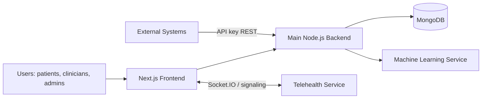
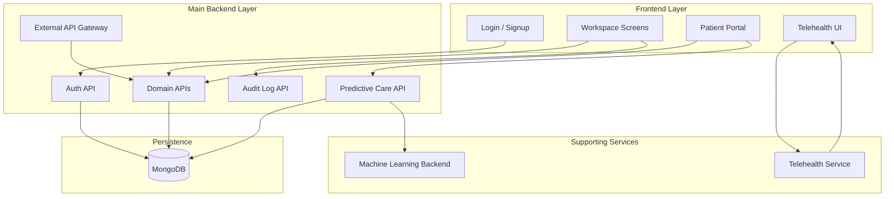
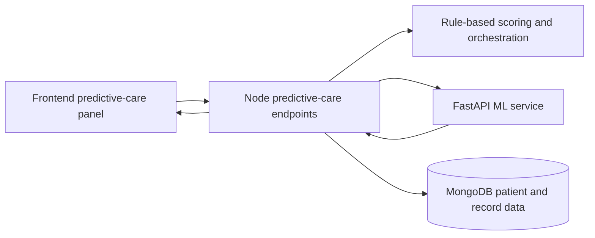

# PMS Project Overview

This document describes the overall architecture of the Patient Management System, with the main focus on the frontend and the primary Node.js backend. The telehealth and machine learning subsystems are included as supporting services and are described briefly where they connect to the core system.

## 1. Main Features

The application is built around a clinical workflow for patients, staff, and administrators. Its main features are:

- appointment management for creating, viewing, confirming, updating, and cancelling appointments
- patient management for viewing and maintaining patient profiles and linked demographic data
- health record management for visits, labs, imaging, notes, prescriptions, and vaccinations
- prescription invoice management for creating, viewing, updating, and syncing prescription invoices
- predictive care analytics for risk scoring, lab forecasting, adherence analysis, and anomaly detection
- authentication and account management for login, logout, registration, and profile lookup
- staff and role-based access control so users only see the actions allowed by their role
- audit logging for tracking sensitive operations and sending logs to the admin subsystem
- telehealth calling for appointment-based real-time consultation sessions
- external subsystem integration for exchanging data with admin, staff, inventory, and ML services

The frontend exposes these features through the patient portal and the clinician workspace, while the Node backend enforces the business rules and data access for each feature.

## 2. Integration Method Used

The system uses a service-based integration model.

- The frontend is a Next.js application that communicates with the main backend through HTTP requests.
- The main backend is an Express.js API that owns authentication, patient data, appointments, health records, prescription invoices, predictive-care orchestration, audit logging, and external API access.
- The machine learning subsystem is a separate Python FastAPI service. The Node backend does not expose it directly to the browser; instead, it acts as the integration layer and forwards prediction and retraining requests to the ML service.
- The telehealth subsystem is a separate real-time service accessed from the frontend through Socket.IO and WebRTC-oriented signaling.
- MongoDB is the shared persistence layer for the main backend and the ML feature/training workflows.

Integration is therefore handled through a mix of:

- REST/JSON for the frontend-to-backend path
- Bearer-token authentication for user sessions
- API key authentication for external system access
- Socket.IO for telehealth real-time signaling
- Internal HTTP calls from the Node backend to the ML service

## 3. System Components

### Frontend

The frontend is a Next.js app located in `pms-frontend`.

Main responsibilities:

- user login, signup, and authenticated workspace navigation
- patient portal screens for profile, appointments, records, stats, and predictive care
- clinician/workspace screens for dashboard, patients, records, settings, and audit logs
- telehealth call UI
- shared client API helpers that wrap backend requests and session handling

Important frontend building blocks:

- `app/layout.tsx` sets the global app shell and typography
- `app/(workspace)/layout.tsx` wraps protected workspace routes with auth and shell UI
- `lib/api.ts` and `lib/patient-api.ts` centralize browser API calls
- `lib/telehealth.ts` creates the telehealth Socket.IO client
- `app/components/predictive-care/patient-predictive-care-panel.tsx` renders predictive-care data and charts

### Main Backend

The main backend is a Node.js + Express application in the repository root.

Main responsibilities:

- JWT-based authentication and role-based access control
- patient, appointment, health record, prescription invoice, and audit log APIs
- external system endpoints protected by API keys
- predictive-care orchestration and ML service bridging
- MongoDB persistence and validation
- security middleware such as helmet, CORS, rate limiting, sanitization, and compression

Key backend route groups:

- `/api/v1/auth`
- `/api/v1/patients`
- `/api/v1/appointments`
- `/api/v1/health-records`
- `/api/v1/prescription-invoices`
- `/api/v1/predictive-care`
- `/api/v1/audit-logs`
- `/api/v1/external`

### Machine Learning Subsystem

The ML backend is a separate FastAPI service in `machine_learning_backend`.

It provides:

- patient-level prediction endpoints
- a retraining endpoint
- lab forecasting
- anomaly detection
- model training and feature extraction pipelines

In this project it is treated as a supporting service. The Node backend owns the business-facing API and fetches predictions from the ML service when needed.

### Telehealth Subsystem

Telehealth is a separate real-time channel used for appointment-based calls.

The frontend connects to it through Socket.IO and uses a bearer token for authentication. This subsystem is intentionally separated from the main REST API because it needs low-latency, event-driven signaling instead of standard request/response traffic.

## 4. System Communication Flow

The main communication path is:

1. The user opens the Next.js frontend.
2. The frontend sends a login request to the Node backend.
3. The backend authenticates the user and returns a JWT session token.
4. The frontend stores the token locally and includes it in subsequent requests as `Authorization: Bearer <token>`.
5. The frontend fetches patient, appointment, record, and predictive-care data from the Node API.
6. When predictive-care data is requested, the Node backend may call the ML service internally, merge the output with rule-based scoring, and return the combined result to the frontend.
7. For telehealth, the frontend opens a Socket.IO connection to the telehealth service using the same authenticated session token.
8. For external or partner integrations, third-party systems call the Node backend using API keys rather than JWTs.

### Communication by subsystem

- Frontend to main backend: HTTPS REST requests with JSON payloads
- Main backend to MongoDB: direct database access via Mongoose
- Main backend to ML service: internal HTTPS requests with JSON payloads
- Frontend to telehealth: Socket.IO signaling plus browser media APIs
- External systems to backend: HTTPS REST requests with API key headers

## 5. Data Flow In The System

The data flow is centered on the Node backend and MongoDB.

### Core operational flow

1. Users log in through the frontend.
2. The frontend sends credentials to `/api/v1/auth/login`.
3. The backend validates the credentials and returns a token plus user/session information.
4. The frontend uses the token to request domain data such as patients, appointments, records, prescriptions, and predictive-care results.
5. The backend reads and writes MongoDB collections for the corresponding domain objects.
6. Predictive-care requests are enriched with rule-based analytics and, when available, ML predictions from the separate ML backend.
7. Telehealth call pages use appointment context from the frontend and establish real-time session signaling through Socket.IO.

### Data flow emphasis

- Clinical data is stored primarily in MongoDB and served by the Node backend.
- The frontend is a consumer of API data and does not talk directly to MongoDB or the ML service.
- Predictive outputs are computed server-side and returned as part of the business API response.
- Telehealth signaling data moves through a separate real-time channel and is not mixed with the standard REST data flow.

## 6. DFD Diagrams

### Level 0 Context Diagram



### Level 1 Data Flow Diagram



### Predictive Care Data Path



## 7. API Overview

### Main Backend APIs

The frontend primarily consumes the following REST API groups from the Node backend:

- `POST /api/v1/auth/login` - authenticate user and obtain a session token
- `POST /api/v1/auth/logout` - invalidate the session
- `GET /api/v1/auth/me` - fetch the current authenticated user
- `GET /api/v1/patients/...` - patient profile and administrative patient operations
- `GET /api/v1/appointments/...` - appointment management and patient-facing appointment views
- `GET /api/v1/health-records/...` - clinical records and patient record views
- `GET /api/v1/prescription-invoices/...` - prescription invoice management
- `GET /api/v1/predictive-care/profiles/:patientId` - predictive risk profile
- `GET /api/v1/predictive-care/analytics/:patientId/lab-trends` - lab trend data
- `GET /api/v1/predictive-care/analytics/:patientId/lab-forecast` - lab forecast data
- `GET /api/v1/predictive-care/analytics/:patientId/risk-radar` - risk radar data
- `GET /api/v1/predictive-care/analytics/:patientId/adherence` - adherence data
- `GET /api/v1/predictive-care/analytics/:patientId/alert-timeline` - alert timeline data
- `POST /api/v1/predictive-care/ml/retrain` - trigger ML retraining through the Node backend
- `GET /api/v1/audit-logs` - audit log retrieval for authorized users

### External API Surface

The backend also exposes API-key protected routes under `/api/v1/external` for third-party access.

These are used for controlled system-to-system reads and updates, especially around patients, appointments, health records, and prescription invoices.

### Telehealth API Surface

Telehealth is handled outside the standard REST layer. The frontend uses Socket.IO connection setup from `lib/telehealth.ts` and connects with:

- a configured telehealth service URL
- the stored bearer token
- polling and websocket transports

### Machine Learning API Surface

The Node backend calls the ML service internally using JSON-based endpoints such as:

- `GET /health`
- `GET /predict/full/:patient_id`
- `POST /predict/lab-forecast`
- `POST /train`

The browser does not call these directly in the normal flow; it talks to the Node backend instead.

## 8. Subsystem Data Exchange Formats

This section focuses on the external or separately deployed systems that the platform exchanges data with. The consistent pattern across all of them is JSON over HTTPS, but the authentication and payload shape differ by subsystem.

### 7.1 Predictive Care Subsystem

The predictive-care subsystem receives patient context and clinical history so it can return risk and forecasting results.

What is sent:

- patient identifiers
- demographic context when needed
- health-record history such as visits, labs, medications, vitals, and diagnoses
- recent trends or feature snapshots for scoring

What is returned:

- overall risk scores and risk levels
- chronic, readmission, adherence, and anomaly signals
- lab forecasts and trend outputs
- feature-level explanations or top contributing factors

Format:

- HTTPS REST
- JSON request and response bodies
- bearer-authenticated when called through the main backend

Typical request model:

```json
{
  "patient_id": "PAT-20260506-0061",
  "test_name": "HbA1c",
  "last_values": [7.2, 7.5, 7.8]
}
```

Typical response model:

```json
{
  "profile": {
    "overall_risk_score": 72,
    "overall_risk_level": "High",
    "ml_readmission_prob": 0.64,
    "ml_chronic_level": "High"
  },
  "predictive_care_disclaimer": "Decision support only."
}
```

Important note:

- the frontend does not call the ML service directly in the normal flow
- the Node backend acts as the gateway and combines ML outputs with rule-based scoring before returning results to the UI

### 7.2 Admin Audit and Staff Authentication Subsystem

This integration covers two related flows: audit log delivery to the admin system and staff authentication/authorization traffic.

What is sent to the admin/audit system:

- audit event type
- actor identity and role
- affected entity type and ID
- timestamp and metadata such as IP address or action details

What is returned:

- acknowledgement of ingestion
- stored audit-log data when queried through admin-facing endpoints

What is sent for staff authentication:

- login credentials or session token exchange during authentication
- bearer token after login for protected staff requests
- role and permission claims in the token payload

What is returned:

- JWT session token
- authenticated staff profile
- authorization outcome for protected requests

Format:

- HTTPS REST
- JSON payloads
- bearer token for authenticated requests
- API key headers for subsystem-to-subsystem access where configured

API-key process:

- the subsystem caller includes `X-Subsystem-Key` when sending audit events to the admin system
- the backend hashes and stores API keys, then checks them against the active key record before accepting requests
- API keys can be created, viewed, revoked, deleted, or rotated by authorized users through `/api/v1/api-keys`
- the full secret is returned only once at creation or rotation time
- inbound requests from external systems use `x-api-key`

Typical audit event model:

```json
{
  "user_id": "8d88697e-1449-4f32-b4c6-ef9450eb02f7",
  "action_type": "PATIENT_LISTED",
  "details": "Patient list viewed",
  "ip_addr": "::1",
  "subsystem": "Patient"
}
```

Typical staff auth model:

```json
{
  "email": "staff@example.com",
  "password": "********"
}
```

Typical auth response model:

```json
{
  "token": "eyJhbGciOi...",
  "user": {
    "sub": "USER-ID",
    "role": "staff",
    "fullName": "Clinic Staff"
  }
}
```

### 7.3 Staff Health Record Subsystem

This integration is used when health-record details are shared with staff-facing workflows.

What is sent:

- patient ID and record ID
- record type, date, provider, and clinical summary
- structured details for visits, prescriptions, labs, imaging, notes, or vaccinations

What is returned:

- health-record lists or single-record details
- status responses for create or update operations
- validation errors if the payload is incomplete or invalid

Format:

- HTTPS REST
- JSON request and response bodies
- authenticated with JWT for internal staff users
- API key authentication for approved external callers when exposed through the external route group

Typical health-record model:

```json
{
  "record_id": "REC-abc123",
  "patient_id": "PAT-20260506-0061",
  "patient_name": "Jane Brown",
  "record_type": "Visit",
  "record_date": "2026-05-10T10:30:00.000Z",
  "provider": "Dr. Smith",
  "summary": "Routine follow-up",
  "details": {
    "diagnosis": "Hypertension",
    "notes": "Blood pressure improving"
  }
}
```

Common response envelope:

```json
{
  "success": true,
  "data": {
    "record": { }
  },
  "meta": {
    "results": 1,
    "pagination": {
      "page": 1,
      "limit": 20,
      "total": 1
    }
  }
}
```

### 7.4 Prescription Invoice and Inventory Subsystem

This integration connects prescription invoices with the inventory and medicine subsystem.

What is sent:

- patient and provider details
- medicine line items
- prescribed quantity, dosage, unit price, and date range
- invoice status updates such as release or payment-related changes

What is returned:

- invoice creation or update responses
- inventory availability data
- stock quantity, pricing, expiry, and status information
- errors when a medicine is not available or requested quantity exceeds stock

Format:

- HTTPS REST
- JSON payloads
- API key authentication for inventory access
- authenticated backend calls when invoice data is created or updated internally

Inventory API-key flow:

- the Node backend reads `PRESCRIPTION_API_URL` for the inventory endpoint
- it sends either `Authorization: Bearer <token>` or `x-api-key: <key>` depending on the configured secret
- inventory responses are cached briefly on the backend to reduce repeated calls
- if inventory data is missing or invalid, the backend returns a `502` or `500` style error to the caller

Typical prescription invoice model:

```json
{
  "invoice_id": "INV-20260510-001",
  "patient_id": "PAT-20260506-0061",
  "patient_name": "Jane Brown",
  "health_record_id": "REC-abc123",
  "medicines": [
    {
      "medicineId": "AMOX-500",
      "medicineName": "Amoxicillin",
      "prescribedDosage": "500mg",
      "prescribedQuantity": 10,
      "unitPrice": 2.5,
      "totalPrice": 25
    }
  ],
  "status": "Pending"
}
```

Typical inventory item model:

```json
{
  "id": "AMOX-500",
  "name": "Amoxicillin",
  "dosage": "500mg",
  "quantity": 120,
  "price": 2.5,
  "expiry": "2026-12-31",
  "status": "IN STOCK"
}
```

Typical inventory request headers:

```http
Accept: application/json
x-api-key: sk_live_xxxxx
```

### Exchange Summary

- predictive care exchanges patient clinical history and returns risk analytics
- admin audit exchanges event logs and staff auth data
- staff health-record exchange shares clinical record details for operational use
- prescription inventory exchange shares invoice and stock data for medicine fulfillment

### Exchange Models At A Glance

- predictive care: `patient_id`, `health records`, `trends`, `risk scores`, `top factors`
- admin audit and staff auth: `action_type`, `user_id`, `details`, `ip_addr`, `token`, `permissions`
- staff health records: `record_id`, `patient_id`, `record_type`, `record_date`, `provider`, `summary`, `details`
- inventory and prescription: `invoice_id`, `medicines[]`, `quantity`, `unitPrice`, `stock`, `expiry`, `status`

## 9. Data Exchange Format

### REST Data Format

The dominant data exchange format is JSON.

Common REST request/response traits:

- `Content-Type: application/json` for JSON payloads
- `Accept: application/json` for all client requests
- bearer token in `Authorization` for authenticated requests
- API keys in custom headers for external system access
- response envelopes that commonly wrap the payload under a `data` field

### Auth Format

Session authentication is token-based:

- the frontend stores the token locally
- the API helpers add `Authorization: Bearer <token>` automatically
- if a request returns `401`, the frontend clears the session and redirects to login

### Telehealth Format

Telehealth uses event-driven Socket.IO messages rather than a single fixed JSON envelope.

Typical data passed over telehealth includes:

- appointment identifiers
- user identity claims
- call invitation metadata
- room-join and peer-count events

### ML Data Format

The ML subsystem also uses JSON.

Typical ML payloads include:

- patient identifiers
- test names and recent values for lab forecasts
- prediction outputs such as risk scores, confidence, and top factors
- retraining requests with model selection options

## 10. Brief Notes On Telehealth And Machine Learning

### Telehealth

Telehealth is a supporting real-time service. It is important to the product, but it is not the main data backbone. The frontend launches the call experience, while the telehealth service handles live signaling and room state.

### Machine Learning

The machine learning system is also a supporting service. It contributes predictive-care insights, but the main backend remains the authoritative integration layer. That keeps the browser talking to one API surface and keeps all ML access behind the application server.

## 11. Summary

The architecture is intentionally split into a clear core and two supporting services:

- the frontend presents the experience and manages user interaction
- the Node backend owns the application logic, security, and data access
- MongoDB stores the operational data
- the ML backend provides predictive assistance
- the telehealth service provides real-time communication

This keeps the browser simple, keeps sensitive logic on the server, and makes the integration boundaries explicit.